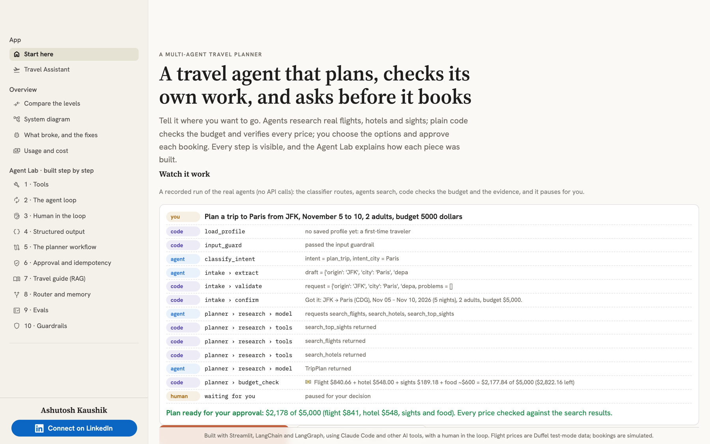
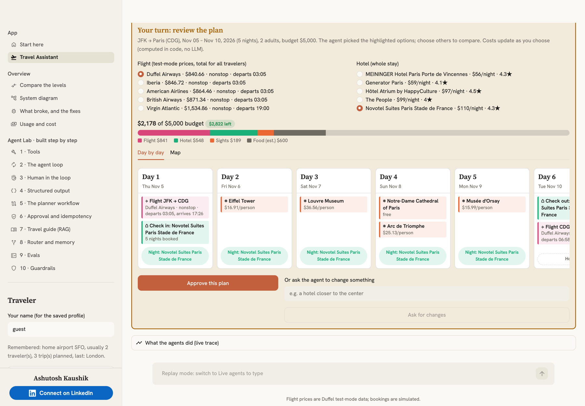
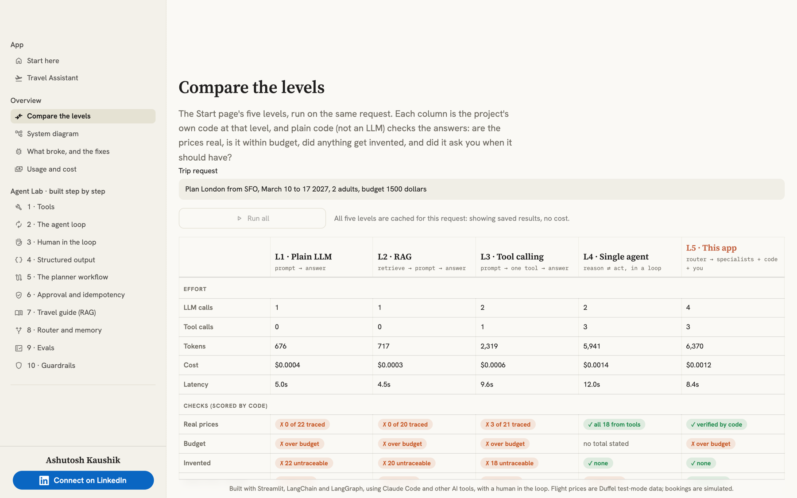
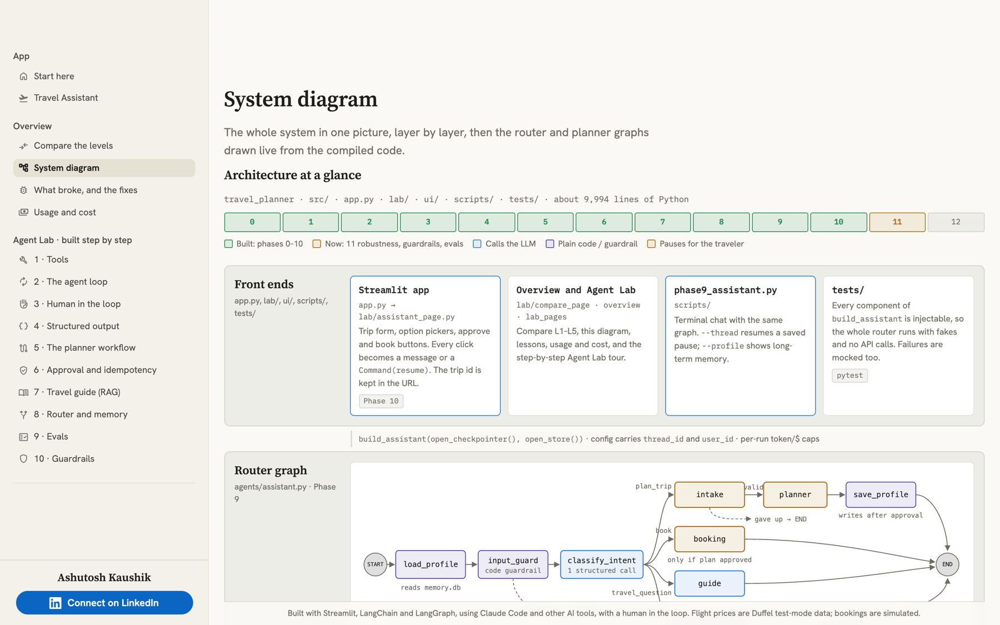

# Travel Agent Lab

**▶ Live app: [ai-travel-agent.streamlit.app](https://ai-travel-agent.streamlit.app/)**

A multi-agent travel planner built with LangChain and LangGraph. Tell it where you want to go: agents research real flights, hotels and sights, plain code checks the budget and verifies every price, and you choose the options and approve each booking. Every step is visible, and the Agent Lab explains how each piece was built.

**Part of a three-app series**, all with the same look and layout:
[AI Model Evolution Explorer](https://ai-model-explorer.streamlit.app/) ·
[AI History Research Assistant](https://ai-history-rag.streamlit.app/) (RAG) ·
[Travel Agent Lab](https://ai-travel-agent.streamlit.app/) (multi-agent)

## Screenshots

| | |
|---|---|
|  |  |
| Start here: a recorded run of the real agents | Travel Assistant: review the plan before anything is booked |
|  |  |
| Compare the levels: plain LLM → this app, on the same request | System diagram: drawn live from the compiled graphs |

## What's inside

The sidebar groups the pages. Light and dark themes follow your system setting.

### App
- **Start here:** the step from a plain LLM to RAG, tool calling, a single agent and this multi-agent app, plus *Watch it work*, a recorded run replayed step by step.
- **Travel Assistant:** plan a trip with the form or in your own words. A live trace shows each agent, tool call and result; questions and approvals appear as buttons.

### Overview
- **Compare the levels:** the same trip request run by a plain LLM, RAG, tool calling, a single agent and this app, side by side.
- **System diagram:** the whole system layer by layer, plus the router and planner graphs drawn from `graph.get_graph()`.
- **What broke, and the fixes:** real failures from building and running the app, and how each was fixed.
- **Usage and cost:** every API call, LLM call, step and turn, logged and priced.

### Agent Lab · built step by step
Ten pages, one per concept: **1 · Tools**, **2 · The agent loop**, **3 · Human in the loop**, **4 · Structured output**, **5 · The planner workflow**, **6 · Approval and idempotency**, **7 · Travel guide (RAG)**, **8 · Router and memory**, **9 · Evals**, **10 · Guardrails**.

## How it works

**[Interactive architecture diagram](https://htmlpreview.github.io/?https://github.com/ashutoshkaushik/ai-travel-agent/blob/main/docs/architecture.html)** ([source file](docs/architecture.html), model: [docs/architecture.json](docs/architecture.json)): every component links to the code it describes. Generated with [Archify](https://github.com/tt-a1i/archify); search nodes, trace paths, switch light/dark, export PNG or SVG.

```
                    ┌──────────────────────┐
  Traveler msg ───▶ │  Intent classifier   │  structured output
                    └──────────┬───────────┘
        ┌──────────────┬───────┴───────┬──────────────┐
        ▼              ▼               ▼              ▼
   Trip planner    Booking agent   Travel guide    Fallback
   (subgraph)      (approval        agent (RAG)
                    middleware)

Trip planner subgraph:
   research_agent ─▶ budget_check (plain Python)
         ▲                │
         └── over budget: cheaper hotel, at most 2 tries
                          ├── still over ─▶ ask the traveler
                          ▼
                    review_plan ─▶ approve / modify
```

- **Router:** an intent classifier sends each message to the trip planner, the booking agent, the travel guide or a fallback.
- **Trip planner:** a research agent finds flights, hotels and sights with tools; plain code checks the total against the budget and swaps to a cheaper hotel up to twice before asking the traveler.
- **Booking agent:** writes go through human-in-the-loop middleware (approve, edit or reject), with idempotency keys so a resumed run never double-books.
- **Travel guide:** agentic RAG over guides for 8 cities; it answers only from retrieved text, cites its sources, and says so when the answer isn't in the guides.
- **Memory:** a SQLite checkpointer keeps each trip across restarts, and a profile store remembers the traveler's home airport and preferences.
- **Robustness and guardrails:** retries with backoff, a circuit breaker per provider, a fallback model, per-run cost caps, and input and output guards (tool results are treated as untrusted data).
- **Evals:** 26 cases scored on the final result, the steps taken and answer quality. Recorded API and LLM responses make reruns free and deterministic, and CI runs them on every pull request.

## Tech stack

| Need | Provider |
|---|---|
| Agents and graphs | LangChain + LangGraph |
| LLM | OpenAI `gpt-4o-mini` |
| Flights | Duffel (test mode, synthetic prices) |
| Hotels and sights | SerpApi (Google Hotels, Google top sights) |
| Weather | Open-Meteo (no key) |
| Travel guides | Local Markdown, in-memory vector store, OpenAI embeddings |
| Persistence | SQLite (checkpoints, bookings, profile) |
| App | Streamlit |
| Environment | Python 3.12, managed by `uv` |

## Run it locally

```bash
uv sync
cp .env.example .env      # add OPENAI_API_KEY, DUFFEL_ACCESS_TOKEN (test token), SERPAPI_API_KEY
uv run streamlit run app.py
```

Without an OpenAI key the app runs on recorded data only: replays, the Compare page and the Lab work, and live planning is turned off with a note.

**Tests and evals** (offline, no API calls):

```bash
uv run pytest -q
uv run python -m evals.run --offline --no-judge --no-save
```

Re-record the eval responses with `uv run python -m evals.run` (needs keys).

## Deploy to Streamlit Community Cloud

1. At [share.streamlit.io](https://share.streamlit.io), click **Create app**, pick this repo, set the main file to `app.py` and, under *Advanced settings*, the Python version to **3.12**.
2. Leave the secrets empty to run keyless on recorded data, or add `OPENAI_API_KEY`, `DUFFEL_ACCESS_TOKEN` and `SERPAPI_API_KEY` for live planning.
3. Deploy. Every push to `main` redeploys the app.

## Project layout

| Path | Purpose |
|---|---|
| `app.py` | Entry point: registers the pages in the App / Overview / Agent Lab groups |
| `src/travel_planner/agents/` | Router, trip intake, research agent, trip planner, booking agent, guide agent |
| `src/travel_planner/tools/` | Flights, hotels, activities, geo, booking and ask-the-traveler tools |
| `src/travel_planner/` | Models, prompts, guardrails, limits, caching, persistence, usage logging |
| `lab/` | Pages: Start here, Travel Assistant, Compare, Overview, Agent Lab, recorded runs |
| `ui/` | Theme tokens, author card and footer |
| `guides/` | Travel guides for the 8 supported cities |
| `evals/` | Eval dataset, scorers, LLM judge, recorded responses |
| `tests/` | pytest suite (fake LLM, no keys) |
| `scripts/` | API checks, per-phase demos, replay recorder, usage report |
| `PLAN.md` | Phased build plan and decisions |

## Credits

- Flight prices come from Duffel's test mode and are synthetic; bookings go to a local ledger, never a real airline or hotel.
- Built by Ashutosh Kaushik · [LinkedIn](https://www.linkedin.com/in/ashutosh-kaushik/)
